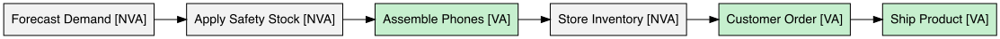
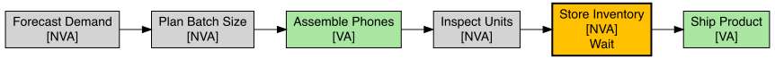

```{r setup, include=FALSE}
knitr::opts_chunk$set(echo = TRUE)
library(ggplot2)
library(qcc)
library(knitr)
library(DiagrammeR)
library(DiagrammeRsvg)
library(rsvg)
library(SixSigma)
library(openxlsx)
library(tidyr)
library(dplyr)
```
data/
# 1. Course Scenario and Problem Overview

## 1.1 Course Scenario
I am focusing on the inventory and production system for a company that designs, assembles and ships foldable smartphones. These devices are made from high-end components like flexible OLED panels(display), precision hinges, battery sets, and custom motherboards, etc. The production team assembles phones in batches based on internal demand forecasts. However, customer orders arrive unpredictably through online and retail stores. Finished products(phones) are stored in inventory until they are shipped after a customer order is received.

## 1.2 Problem: Overproduction and Excess Inventory
In my course scenario, I am exploring a common issue in manufacturing: Overproduction. Foldable phone companies often produces more units than necessary, leading to excess inventory of finished products (phones). This causes the companies having high storage costs, ties up capital, and risking product obsolescence if they decided to release a new model or consumer demand changes.

I assume this issue might be caused by:

- Inaccurate demand forecasting;
- Overly conservative safety stock policies;
- Poor communication between production and sales teams;
- Lack of real-time visibility into customer orders

In this project, I will simulate a realistic production and inventory data to analyze this problem using DMAIC and identify areas where the process can be improved. 


# 2. Define Phase

## 2.1 Project Charter: Reducing Excess Inventory in Foldable Phone Production

### 2.1.1 Problem Statement:
In my scenario, the company often produces more foldable phones than the actual market demands, resulting in a excessive inventory. Those never used finished goods increase storage costs, tie up capital, and risking product obsolescence when newer models are released. I assume that this overproduction might be caused by inaccurate forecasts, disconnected information flow between departments, and rigid batch production policies.

### 2.1.2 Business Case / Opportunity:
By analyzing and improving this process, the company could save money on storage, reduce obsolete stock, and be more responsive to customer's demand. This would increase overall efficiency and customer satisfaction, especially in a competitive tech market like foldable phones.

### 2.1.3 Goal / Objective:
The goal of this project is to use statistical tools to analyze variability in production versus demand, identify the key sources of waste, and recommend improvements that reduce excess inventory while maintaining service levels.

### 2.1.4 Scope:
This project focuses on the process from internal demand forecasting, through batch production, and includes the inventory storage of finished foldable phones. It ends just before the point of customer order fulfillment and shipping. The scope does not include raw material sourcing, product returns, or customer satisfaction tracking after delivery.

### 2.1.5 Stakeholders:
I myself will do all the steps of this project, including scenario design, data simulation, statistical analysis, and final recommendations.

### 2.1.6 Timeline:
This project was completed using a focused, time-efficient analysis sprint with simulated data representing a 30-day process window.

## 2.2 Voice of the Customer (VoC)
“I want my foldable phone to arrive as fast as possible, because I don’t want to wait for too long until all of my excitement are gone.”

### 2.3 Critical to Quality (CTQ)

| CTQ | Reason |
|-|-|
| Inventory turnover > 2/mo | Reduces overstock and storage cost |
| Forecast error < 10% | Aligns production with actual demand |
| Inventory level $\le$ 1.5 times daily demand | Prevents excessive buildup and improves production agility |

These CTQ reflect customer and business needs: inventory turnover over 2 per month ensures that products won't be stay unused, reducing waste and improving responsiveness; forecast error under 10% limits overproduction and ensures alignment with real demand; and capping inventory at 1.5 times daily demand prevents waste from excessive stockpiling.

## Tollgate – Define Phase
The issue of excess inventory in foldable smartphone production has been clearly defined. I’ve outlined the project scope, key stakeholders, and CTQ requirements. 


# 3. Measure Phase

## 3.1 Key Variables (Key Process Input Variables &  Key Process Output Variables)

### 3.1.1 KPIV
These are the variables that affect how much you produce and store:

- Forecasted demand
- Batch production size
- Safety stock level
- Forecast error
- Production delay

### 3.1.2 KPOV
These are the results that we care about:

- Actual inventory level
- Excess inventory (over-demand)
- Inventory turnover rate
- Number of overproduction events

## 3.2 Simulate Realistic Data
I will simulate 30 days of production using:

- Forecasted daily demand (randomly)
- Actual daily demand (adds noise to forecast)
- Daily production (based on forecast + safety stock)
- Inventory = previous inventory + production - demand

```{r, message=FALSE, warning=FALSE, echo = FALSE}
set.seed(100)
days <- 1:30
fcst <- round(rnorm(30, 500, 50))
demand <- round(fcst + rnorm(30,  0, 30))
prod <- round(fcst * 1.15)
inv <- cumsum(prod - demand)
avg_i <- (c(0, head(inv, -1)) + inv) / 2
f_err <- demand - fcst
f_pct <- f_err / fcst
total_demand <- sum(demand)
avg_month_inv <- mean(avg_i[-1])
turnover_month <- total_demand / avg_month_inv
daily_ratio <- inv / demand
peak_daily_ratio <- max(daily_ratio)

inventory_df <- data.frame(
  Day = days,
  Forecast = fcst,
  F_Error = f_err,
  F_Pct = round(f_pct, 4),
  Demand = demand,
  Produced = prod,
  Inventory = inv
)

knitr::kable(head(inventory_df), caption = "First 6 days of simulated data")

ggplot(inventory_df, aes(x = F_Pct)) +
  geom_histogram(fill = "grey", colour = "black") +
  geom_vline(xintercept = c(-0.10, 0.10), linetype = "dashed") +
  labs(title = "Histogram of Forecast Error (Percentage)",
       x = "Forecast Error (Actual - Forecast) / Forecast",
       y = "Frequency") +
  theme_minimal()

ggplot(inventory_df, aes(x = Day, y = Inventory)) +
  geom_line() +
  geom_hline(yintercept = 0, linetype = "dashed") +
  labs(title = "Cumulative Inventory Over 30 Days",
       x = "Day", y = "Units in Inventory") +
  theme_minimal()

daily_ratio <- inv / demand
peak_daily_ratio <- max(daily_ratio, na.rm = TRUE)


mean_abs_error <- mean(abs(f_pct))
pct_days_violated <- mean(abs(f_pct) > 0.10)

list(
  turnover_month = turnover_month,
  peak_daily_ratio = peak_daily_ratio,
  mean_abs_error = mean_abs_error,
  pct_days_violated = pct_days_violated
)
```
### See codes in Appendix A
**Interpretation:**
The monthly turnover appears high (13.8), but this is misleading—early days had low starting inventory, and overproduction caused a steady buildup. The rising inventory curve confirms that stock is not actually turning over efficiently. 

Please note, this is a monthly turnover metric (total demand ÷ avg inventory). Daily ratios will be used later for comparing scenarios, but the CTQ target stays on the monthly scale (> 2). 

The peak inventory-to-demand ratio over 30 days was `r round(peak_daily_ratio, 2)`, exceeding the CTQ threshold of 1.5. So the CTQ was not met. Although the average forecast error was 5.6%, it exceeded $\pm$ 10% on 16.7% of days—violating the CTQ and supporting the need for improvement.

## Tollgate - Measure Phase
I’ve identified key input and output variables and simulated realistic production data. Metrics like forecast error and turnover confirm that overproduction is a measurable issue. With these insights, the project moves to the Analyze Phase.


# 4. Analyze Phase

## 4.1 Check Sheet – Source of Defect Data
To begin analyzing the root causes of excess inventory, I created a check sheet that records the presence (1) or absence (0) of common defects across 10 simulated days out of the full 30-day simulation. These include issues in forecasting, production, and communication.

```{r, message=FALSE, warning=FALSE, echo = FALSE}
check_sheet <- data.frame(
  Day = paste0("Day ", 1:10),
  Old_data_used = c(1, 1, 0, 0, 1, 0, 1, 1, 0, 0),
  No_peak_adjustment = c(0, 0, 0, 1, 0, 0, 0, 0, 1, 0),
  Overproduction = c(1, 1, 1, 1, 0, 1, 1, 0, 1, 1),
  Wrong_batch_size = c(0, 0, 0, 0, 0, 1, 0, 0, 0, 0),
  No_team_updates = c(0, 1, 0, 1, 0, 0, 1, 0, 1, 0),
  Forecast_not_shared = c(1, 0, 1, 1, 0, 1, 1, 0, 0, 1)
)

knitr::kable(check_sheet, caption = "Check Sheet for Observed Defects Over 10 Days")
```
### See codes in Appendix B
**Interpretation:** This check sheet shows that the most common issues are Overproduction (8), Forecast not shared (6), and Old data used (5), which suggests that the problems are in forecasting and team communication.

## 4.2 Pareto Chart of Excess Inventory Causes
```{r, message=FALSE, warning=FALSE, echo = FALSE}
defect_totals <- colSums(check_sheet[, -1])
names(defect_totals) <- gsub("_", " ", names(defect_totals))

# Pareto chart
pareto.chart(defect_totals,
             main = "Pareto Chart of Defects (From Check Sheet)",
             col = gray.colors(length(defect_totals)),
             ylab = "Frequency")
```
### See codes in Appendix C
**Interpretation:** The Pareto chart confirmed that "Overproduction", "Forecast not shared", and "Old data used" account for over 70% of observed issues, consistent with the 80/20 rule. These root causes are tied to poor forecasting and communication, making them the priorities for improvement.

## 4.3 Cause-and-Effect Diagram (Fishbone)
```{r, message=FALSE, warning=FALSE, echo = FALSE}
fishbone_causes <- list(
  Forecasting = c("Overestimation", "Old data", "No peak adjustment"),
  Production = c("Too high safety stock", "Fixed batch sizes", "Inflexible scheduling"),
  People = c("Poor communication", "Forecast not shared", "No owner", "Lack of training"),
  Systems = c("No excess review", "Disconnected data", "Manual overrides")
)

cause.and.effect(cause = fishbone_causes, 
                 effect = "Excess Inventory")
```

### See codes in Appendix D
**Clarification:** This cause-and-effect diagram now includes “Forecast not shared” under the People branch to reflect the communication breakdown identified in the Pareto chart. The structure was built using `qcc::cause.and.effect()` function.

## Tollgate – Analyze Phase
The Pareto and fishbone diagrams point to Overproduction, Forecast not shared, and Old data used as the top root causes. These reflect weak forecasting accuracy and poor team communication.


# 5. Improve Phase

## 5.1 Proposed Improvements
Based on the root causes identified in the Analyze Phase, which are particularly Overproduction, Forecast not shared, and Old data used, I propose the following targeted improvements:

- Improve Forecast Sharing & Accuracy: Based on our simulation results, improving forecast accuracy is the safest fix (zero stock-outs). It reduced average inventory by over 600 units, and increased turnover, and also avoided stockouts. This improvement addresses both the "Old data used" and "Forecast not shared" issues simultaneously.

- Purge Old Data & Prioritize Recent Trends: Update the forecasting model to focus more on recent trends instead of relying too much on old data. This helps fix the “Old data used” issue, and could cut down a great deal in extra inventory, based on my simulation.

- Reduce Safety Stock Buffer: To cut down on excess inventory, I plan to lower the safety stock multiplier from 1.15 to 1.05. This should bring production closer to actual demand. With less overproduction, company will have fewer units sitting in inventory, meaning they will have a higher inventory turnover rate, that’s a win for efficiency without risking major stockouts.

- Standardize Forecasting and Planning Steps: Since I'm working on this project alone, standardizing the decision-making workflow reduces inconsistencies and manual errors. This prevents variation caused by unstructured changes in planning.

## 5.2 Simulate Post-Improvement Impact
```{r, message=FALSE, warning=FALSE, echo = FALSE}
set.seed(100)

days <- 1:30
forecast_demand <- round(rnorm(30, 500, 50))
actual_demand <- round(forecast_demand + rnorm(30, 0, 30))

old_safety <- 1.15
old_production <- round(forecast_demand * old_safety)
old_inventory <- cumsum(old_production - actual_demand)

stockout_days <- function(x) sum(x < 0)
monthly_turnover <- function(dem, inv){
  mean_inv <- mean((c(0, head(inv, -1)) + inv) / 2)
  sum(dem) / mean_inv
}

new_safety <- 1.05
new_production <- round(forecast_demand * new_safety)
new_inventory <- cumsum(new_production - actual_demand)

fcst_better <- round(actual_demand + rnorm(30, 0, 30))
prod_better <- round(fcst_better * 1.05)
inv_better <- cumsum(prod_better - actual_demand)

metric_vec <- c("Avg Inventory", "Total Demand",
                "Monthly Turnover", "Stockout Days")

metrics_df <- data.frame(
  Metric = metric_vec,
  Original = c(mean((c(0, head(old_inventory, -1)) + old_inventory) / 2),
               sum(actual_demand),
               monthly_turnover(actual_demand, old_inventory),
               stockout_days(old_inventory)),
  Reduced_SS = c(mean((c(0, head(new_inventory, -1)) + new_inventory) / 2),
                 sum(actual_demand),
                 monthly_turnover(actual_demand, new_inventory),
                 stockout_days(new_inventory)),
  Better_Acc = c(mean((c(0, head(inv_better, -1)) + inv_better) / 2),
                 sum(actual_demand),
                 monthly_turnover(actual_demand, inv_better),
                 stockout_days(inv_better))
)

before_after <- metrics_df |>
  pivot_longer(cols = c(Reduced_SS, Better_Acc),
               names_to  = "Scenario",
               values_to = "After") |>
  mutate(Before = Original,
         Change = round(After - Before, 2)) |>
  select(Scenario, Metric, Before, After, Change) |>
  arrange(Scenario, Metric)

knitr::kable(before_after,
             caption = "Impact of Improvement Scenarios (Monthly Metrics)")
```
### See codes in Appendix E
**Interpretation:**
Reducing the safety stock from 1.15 to 1.05 cut average inventory by over 700 units and boosted turnover from 14 to 49, with only one stockout. Improving forecast accuracy alone also raised turnover to 41 and eliminated stockouts entirely. I recommend implementing the safety stock cut first for fast cost savings, then refining forecasts for long-term stability.

### Tollgate – Improve Phase
I tested targeted fixes like reducing safety stock and improving forecasts. These changes boosted turnover and cut down inventory. The simulation shows that the fixes work.


# 6. Control Phase

## 6.1 Process Capability Analysis – Cp and Cpk  
Because my production plan is based on a fixed multiplier of the forecast (Produced = Forecast × Safety Factor), keeping the forecast error within $\pm$ 10% directly controls how far production deviates from actual demand. That’s why I used $\pm$ 10% of the mean daily demand as the spec limits for this capability analysis—it reflects the same standard as my CTQ. In other words, if forecast error stays within $\pm$ 10%, then the production gap (Produced – Demand) will also stay within $\pm$ 10% of actual demand.

To measure process capability, I used:  
$$
C_p = \frac{USL - LSL}{6\sigma}, \quad
C_{pk} = \min\left( \frac{USL - \mu}{3\sigma}, \frac{\mu - LSL}{3\sigma} \right)
$$ 
where $\mu$is the mean production error and $\sigma$ is its standard deviation. I kept the same spec limits before and after improvement to ensure a fair comparison.

I used the same $\pm$ 10% spec limits based on the original average demand across both before and after phases. This keeps the comparison consistent, since demand didn’t change — only the production plan did.

```{r, message=FALSE, warning=FALSE, echo = FALSE}
prod_gap_before <- inventory_df$Produced - inventory_df$Demand
MR_before <- abs(diff(prod_gap_before))
sigma_before <- mean(MR_before) / 1.128
mu_before <- mean(prod_gap_before)

prod_gap_after <- new_production - actual_demand
MR_after <- abs(diff(prod_gap_after))
sigma_after <- mean(MR_after) / 1.128
mu_after <- mean(prod_gap_after)

abs_limit <- mean(inventory_df$Demand) * 0.10
USL_abs <-  abs_limit
LSL_abs <- -abs_limit

Cp_before <- (USL_abs - LSL_abs) / (6 * sigma_before)
Cpk_before <- min((USL_abs - mu_before) / (3 * sigma_before),
                  (mu_before - LSL_abs) / (3 * sigma_before))

Cp_after <- (USL_abs - LSL_abs) / (6 * sigma_after)
Cpk_after <- min((USL_abs - mu_after) / (3 * sigma_after),
                  (mu_after - LSL_abs) / (3 * sigma_after))

prod_gap_acc <- prod_better - actual_demand
MR_acc <- abs(diff(prod_gap_acc))
sigma_acc <- mean(MR_acc) / 1.128
mu_acc <- mean(prod_gap_acc)

Cp_acc <- (USL_abs - LSL_abs) / (6 * sigma_acc)
Cpk_acc <- min((USL_abs - mu_acc) / (3 * sigma_acc),
               (mu_acc - LSL_abs) / (3 * sigma_acc))

cp_compare <- data.frame(
  Index = c("Cp (Before)", "Cpk (Before)",
            "Cp (After SS)", "Cpk (After SS)",
            "Cp (Better Acc)", "Cpk (Better Acc)"),
  Value = round(c(Cp_before, Cpk_before,
                  Cp_after, Cpk_after,
                  Cp_acc, Cpk_acc), 3)
)

kable(cp_compare,
      caption = "Absolute-Gap Process Capability Comparison Across Scenarios")
```
### See codes in Appendix F
**Interpretation:** Reducing safety stock improved Cpk (–0.174 t0 0.222), showing reduced production bias. However, variability remained unchanged (Cp about 0.398). Improving forecast accuracy raised both Cp (to 0.451) and Cpk (to 0.239), indicating better centering and less variability. Due to its strong turnover performance, I implemented Reduced SS immediately, while keeping forecast accuracy improvement as a long-term plan.

# 6.2 Pre-Improvement (Before Fix) — x-bar.one Chart for Production Gap
```{r, message=FALSE, warning=FALSE, echo = FALSE}
prod_gap <- inventory_df$Produced - inventory_df$Demand
qcc_obj <- qcc(prod_gap, type = "xbar.one", plot = TRUE)
```

### See codes in Appendix G
**Interpretation:** 
Since all 30 points are within the limits, so there are no any rule violations. However, the center line is at +72.5 units, which indicates a chronic onverproduction. Therefore, the process is “in control but off target,” consistent with the low Cpk.

# 6.3 Post-Improvement (After Safety Stock Fix) — x-bar.one Chart for Production Gap
```{r, message=FALSE, warning=FALSE, echo = FALSE}
post_gap <- new_production - actual_demand
qcc_obj_post <- qcc(post_gap, type = "xbar.one", plot = TRUE)
```

### See codes in Appendix H
**Interpretation:**  
The x-bar.one chart shows the daily production gap after applying the safety stock fix. Since the center line dropped from 72.5 to 22.3 units, so it confirmed that there is a significant reduction in production bias.

However, the process is still centered above zero, indicating room for improvement. Combining this fix with improved forecast accuracy (see Section 5.2) could further reduce bias without increasing stockout risk.

## 6.4 Monitoring and Action Plan
To maintain the improvement, I will monitor the following metrics:

- Forecast Error (%): I use \( \frac{\text{Actual} - \text{Forecast}}{\text{Forecast}} \) and flag values outside $\pm$ 10% as red flags. Continuous large errors will trigger review of model accuracy and recent trend detection.

- Inventory Level: If inventory exceeds 1.5× average daily demand, this signals overproduction. In that case, I’ll revisit the safety stock multiplier or pause batches.

- Inventory Turnover: If this drops below 2.0, it suggests stock isn't moving fast enough. That could mean forecast inaccuracy or poor coordination again.

These metrics help track the effectiveness of forecasting and production alignment.

## 6.5 Flowchart – Foldable Phone Production & Inventory Process
```{r, message=FALSE, warning=FALSE, echo = FALSE}
graph <- grViz("
digraph FoldablePhoneFlow {
  graph [rankdir = LR]
  node [shape = box, style = filled, color = black, fontname = Helvetica]

  Forecast   [label = 'Forecast Demand [NVA]', fillcolor = '#F2F2F2']
  Safety     [label = 'Apply Safety Stock [NVA]', fillcolor = '#F2F2F2']
  Produce    [label = 'Assemble Phones [VA]', fillcolor = '#C6EFCE']
  Inventory  [label = 'Store Inventory [NVA]', fillcolor = '#F2F2F2']
  Order      [label = 'Customer Order [VA]', fillcolor = '#C6EFCE']
  Ship       [label = 'Ship Product [VA]', fillcolor = '#C6EFCE']

  Forecast -> Safety -> Produce -> Inventory
  Inventory -> Order -> Ship
}")

svg <- export_svg(graph)
charToRaw(svg) |> rsvg::rsvg_png("plots/flowchart_labeled.png")

```

### See codes in Appendix I
**Comments:** Now, forecasting and inventory storage are explicitly targeted as NVA focus areas due to their outsized role in driving inefficiencies and waste.

## 6.6 SIPOC Diagram
```{r, message=FALSE, warning=FALSE, echo = FALSE}
steps <- c("Forecast [NVA]",
           "Batch size calc [NVA]",
           "Phone assembly [VA]")

inputs.overall  <- c("Orders", "Market data", "BOM", "Labor availability")
outputs.overall <- c("Foldable phones", "Inventory report")

input.output <- vector(mode = "list", length = length(steps))
input.output[[1]] <- list(c("—"))
input.output[[2]] <- list(c("Forecast", "Policy"))
input.output[[3]] <- list(c("Parts", "Staff", "Line"))

x.parameters <- vector(mode = "list", length = length(steps))
x.parameters[[1]] <- list(c("Forecast error", "C"))
x.parameters[[2]] <- list(c("Batch size", "C"))
x.parameters[[3]] <- list(c("Cycle time", "C"))

y.features <- vector(mode = "list", length = length(steps))
y.features[[1]] <- list(c("Accuracy", "Cr"))
y.features[[2]] <- list(c("Inventory", "Cr"))
y.features[[3]] <- list(c("Defects", "Cr"))

ss.pMap(steps,
        inputs.overall,
        outputs.overall,
        input.output,
        x.parameters,
        y.features,
        sub = "SIPOC Diagram – Foldable Phone Production Process")
```

### See codes in Appendix J
**Interpretation:** The SIPOC diagram above maps the foldable phone production process from supplier to customer. The steps are labeled as Value-Added (VA) or Non-Value-Added (NVA) to identify inefficiencies, which also supported by the flowchart. Since both tools show that poor forecasting is a major cause of overproduction, therefore, improving this upstream step is key to better matching supply with demand and cutting down on waste.

## 6.7 Demerit System
To better understand what’s causing excess inventory, I built a Demerit System that breaks down each defect by source, gives a clear description, and assigns a weight based on how serious and frequent it is. This makes it easier to figure out which problems to fix first and keep monitoring.

```{r, message=FALSE, warning=FALSE, echo = FALSE}
demerit_df <- data.frame(
  Defect_Class = c("Production", "Communication",
                   "Forecasting", "Forecasting",
                   "Communication", "Production",
                   "Forecasting"),
  Specific_Defect = c("Overproduction",
                      "Forecast not shared",
                      "Old data used",
                      "No peak adjustment",
                      "No team updates",
                      "Wrong batch size",
                      "Late forecast update"),
  Severity = c(5, 4, 3, 3, 2, 2, 2),
  Occurrence = c(5, 4, 3, 2, 2, 1, 2)
)

demerit_df <- demerit_df |>
  mutate(Weight = Severity * Occurrence)

knitr::kable(demerit_df,
             caption = "Quantified Demerit System (Severity × Occurrence)")
```
### See codes in Appendix K
**Interpretation:** Weights follow the classic Severity times Occurrence rubric (each scored 1-5). Overproduction tops the list (5 × 5 = 25) because it is both frequent and costly, driving excess inventory. I list three separate forecasting defects: Old data used, No peak adjustment, Late forecast update, because each introduces a distinct bias: structural mis‐prediction, lack of seasonality response, and delayed information, respectively. Grouping them would mask their different root causes. This quantified view lets me rank issues and focus improvements where they will slash inventory fastest.

## 6.8 Out-of-Control Action Plan
The Out-of-Control Action Plan (OCAP) connects key monitoring metrics with specific actions to take when something goes wrong. It helps catch problems early, whether in forecasting, inventory, or communication, so they can be fixed before things spiral.

```{r, message=FALSE, warning=FALSE, echo = FALSE}
ocap_table <- data.frame(
  `Trigger Condition` = c(
    "Forecast Error > ±10% for 3 or more days",
    "Inventory exceeds 1.5x average daily demand",
    "Turnover drops below 2.0 consistently",
    "Single point outside control limits",
    "6+ consecutive points above center line",
    "Communication issues reported"
  ),
  Action = c(
    "Review forecasting model; adjust input weights and recent trends.",
    "Lower safety stock multiplier and investigate demand assumptions.",
    "Recalculate batch sizes; consider delaying production.",
    "Pause production; examine recent production and demand data.",
    "Evaluate bias in forecast or manual override; retrain forecasting.",
    "Schedule coordination meeting between sales and production leads."
  )
)

write.xlsx(ocap_table, file = "OCAP_Table.xlsx", sheetName = "OCAP", rowNames = FALSE)

knitr::kable(ocap_table, caption = "Out-of-Control Action Plan (OCAP)")
```
### See codes in Appendix L
**Interpretation:**
Each trigger condition reflects findings from earlier phases:

- Forecast error, inventory level, and turnover thresholds are based on CTQ targets and simulation diagnostics.
- Control chart rules come from Section 6.2–6.3 to catch assignable causes.
 • Communication issues mirror top contributors in the Pareto and Fishbone analyses.

This OCAP aligns monitoring metrics with root causes and offers concrete actions, ensuring sustainable process control.

## 6.9 Value Stream Map
The Value Stream Map (VSM) below builds on the flowchart in Section 6.5 by identifying potential *bottlenecks* in the production process using Lean Six Sigma tools.

```{r}
graph2 <- grViz("
digraph VSM {
  graph [rankdir = LR, fontsize = 12]
  node  [shape = box, style = filled, fontname = Helvetica]

  Forecast [label = 'Forecast Demand\\n[NVA]', fillcolor = '#D3D3D3']
  Plan     [label = 'Plan Batch Size\\n[NVA]', fillcolor = '#D3D3D3']
  Assemble [label = 'Assemble Phones\\n[VA]', fillcolor = '#A8E6A1']
  Inspect  [label = 'Inspect Units\\n[NVA]', fillcolor = '#D3D3D3']
  Store    [label = 'Store Inventory\\n[NVA]\\nWait',  
            fillcolor = '#FFC000', color = 'black', penwidth = 2]
  Ship     [label = 'Ship Product\\n[VA]', fillcolor = '#A8E6A1']

  Forecast -> Plan
  Plan -> Assemble
  Assemble -> Inspect
  Inspect -> Store
  Store -> Ship
}")

# export and include
svg <- export_svg(graph2)
charToRaw(svg) |> rsvg_png("plots/Value_Stream_Map_No_Time.png")

```

### See codes in Appendix M
**Interpretation:**  
This Value Stream Map highlights that “Store Inventory” is the main bottleneck. It’s a Non-Value-Added (NVA) step and a waiting point (orange box), where excess phones pile up before shipment. This delays flow and ties up resources. However, steps like “Forecast Demand” and “Plan Batch Size” are NVA but necessary for planning. In contrast, “Assemble Phones” and “Ship Product” are true Value-Added (VA) activities. Also, the delay at inventory shows that poor coordination between planning and demand causes waste.

To reduce waste and restore flow, the company should minimize batch sizes and improve their forecasting accuracy.

## 6.10 Chance vs Assignable Causes
To ensure a long-term control, it is important to distinguish between chance causes (random variation) and assignable causes (systematic issues).

In this project:

Chance causes are the normal day-to-day ups and downs in customer demand or small shifts in production. They’re expected in any stable process and usually don’t need any action.

Assignable causes, on the other hand, are preventable and recurring. For example: 

- “Forecast not shared” and “Old data used” (as seen in the check sheet and Pareto chart);
- Overproduction driven by rigid safety stock;
- Communication breakdowns between departments

Those assignable causes led to persistent overproduction and buildup in inventory. They were the main drivers of variation in the control charts  and were targeted directly in the OCAP and improvement actions.

By isolating and addressing assignable causes, the process can now be kept stable and better aligned with actual demand.

## Tollgate – Control Phase
In Control Phase, I used process capability metrics (Cp, Cpk) to evaluate whether production aligns with demand, and used a control charts to track stability in both production gaps and forecast error. I also designed an Out-of-Control Action Plan (OCAP) to provide corrective actions when key thresholds are violated, and a Demerit System help focus on the most important root causes. In addition, the flowchart and value stream map clearly show that inventory storage is the biggest bottleneck. These tools work together to ensure that process can stay on track with customer demand and catch overproduction early.

# 7. Final Summary
This project followed the full DMAIC cycle to solve the problem of excess inventory in foldable smartphone production. I simulated a realistic process, identified overproduction and communication issues, and implemented improvements like reducing safety stock and improving forecasts. The results showed better inventory turnover and lower excess, confirmed by capability analysis and control charts. With monitoring tools in place, the process is now more aligned with customer demand and under control. This project shows how data-driven decisions can reduce waste and improve performance.

# Appendices

## Appendix A: Code for Section 3.2
```{r appendix_simulate_data, eval=FALSE}
set.seed(100)
days <- 1:30
fcst <- round(rnorm(30, 500, 50))
demand <- round(fcst + rnorm(30,  0, 30))
prod <- round(fcst * 1.15)
inv <- cumsum(prod - demand)
avg_i <- (c(0, head(inv, -1)) + inv) / 2
f_err <- demand - fcst
f_pct <- f_err / fcst
total_demand <- sum(demand)
avg_month_inv <- mean(avg_i[-1])
turnover_month <- total_demand / avg_month_inv
daily_ratio <- inv / demand
peak_daily_ratio <- max(daily_ratio)

inventory_df <- data.frame(
  Day = days,
  Forecast = fcst,
  F_Error = f_err,
  F_Pct = round(f_pct, 4),
  Demand = demand,
  Produced = prod,
  Inventory = inv
)

knitr::kable(head(inventory_df), caption = "First 6 days of simulated data")

ggplot(inventory_df, aes(x = F_Pct)) +
  geom_histogram(fill = "grey", colour = "black") +
  geom_vline(xintercept = c(-0.10, 0.10), linetype = "dashed") +
  labs(title = "Histogram of Forecast Error (Percentage)",
       x = "Forecast Error (Actual - Forecast) / Forecast",
       y = "Frequency") +
  theme_minimal()

ggplot(inventory_df, aes(x = Day, y = Inventory)) +
  geom_line() +
  geom_hline(yintercept = 0, linetype = "dashed") +
  labs(title = "Cumulative Inventory Over 30 Days",
       x = "Day", y = "Units in Inventory") +
  theme_minimal()

daily_ratio <- inv / demand
peak_daily_ratio <- max(daily_ratio, na.rm = TRUE)


mean_abs_error <- mean(abs(f_pct))
pct_days_violated <- mean(abs(f_pct) > 0.10)

list(
  turnover_month = turnover_month,
  peak_daily_ratio = peak_daily_ratio,
  mean_abs_error = mean_abs_error,
  pct_days_violated = pct_days_violated
)
```

## Appendix B: Code for Section 4.1
```{r, message=FALSE, warning=FALSE, eval=FALSE}
check_sheet <- data.frame(
  Day = paste0("Day ", 1:10),
  Old_data_used = c(1, 1, 0, 0, 1, 0, 1, 1, 0, 0),
  No_peak_adjustment = c(0, 0, 0, 1, 0, 0, 0, 0, 1, 0),
  Overproduction = c(1, 1, 1, 1, 0, 1, 1, 0, 1, 1),
  Wrong_batch_size = c(0, 0, 0, 0, 0, 1, 0, 0, 0, 0),
  No_team_updates = c(0, 1, 0, 1, 0, 0, 1, 0, 1, 0),
  Forecast_not_shared = c(1, 0, 1, 1, 0, 1, 1, 0, 0, 1)
)

knitr::kable(check_sheet, caption = "Check Sheet for Observed Defects Over 10 D
check_sheet <- data.frame(
  Day = paste0("Day ", 1:10),
  Old_data_used = c(1, 1, 0, 0, 1, 0, 1, 1, 0, 0),
  No_peak_adjustment = c(0, 0, 0, 1, 0, 0, 0, 0, 1, 0),
  Overproduction = c(1, 1, 1, 1, 0, 1, 1, 0, 1, 1),
  Wrong_batch_size = c(0, 0, 0, 0, 0, 1, 0, 0, 0, 0),
  No_team_updates = c(0, 1, 0, 1, 0, 0, 1, 0, 1, 0),
  Forecast_not_shared = c(1, 0, 1, 1, 0, 1, 1, 0, 0, 1)
)

knitr::kable(check_sheet, caption = "Check Sheet for Observed Defects Over 10 Days")
```

## Appendix C: Code for Section 4.2
```{r, message=FALSE, warning=FALSE, eval=FALSE}
defect_totals <- colSums(check_sheet[, -1])
names(defect_totals) <- gsub("_", " ", names(defect_totals))

# Pareto chart
pareto.chart(defect_totals,
             main = "Pareto Chart of Defects (From Check Sheet)",
             col = gray.colors(length(defect_totals)),
             ylab = "Frequency")
```

## Appendix D: Code for Section 4.3
```{r, message=FALSE, warning=FALSE, eval=FALSE}
fishbone_causes <- list(
  Forecasting = c("Overestimation", "Old data", "No peak adjustment"),
  Production = c("Too high safety stock", "Fixed batch sizes", "Inflexible scheduling"),
  People = c("Poor communication", "Forecast not shared", "No owner", "Lack of training"),
  Systems = c("No excess review", "Disconnected data", "Manual overrides")
)

cause.and.effect(cause = fishbone_causes, 
                 effect = "Excess Inventory")
```

## Appendix E: Code for Section 5.2
```{r, message=FALSE, warning=FALSE, eval=FALSE}
set.seed(100)

days <- 1:30
forecast_demand <- round(rnorm(30, 500, 50))
actual_demand <- round(forecast_demand + rnorm(30, 0, 30))

old_safety <- 1.15
old_production <- round(forecast_demand * old_safety)
old_inventory <- cumsum(old_production - actual_demand)

stockout_days <- function(x) sum(x < 0)
monthly_turnover <- function(dem, inv){
  mean_inv <- mean((c(0, head(inv, -1)) + inv) / 2)
  sum(dem) / mean_inv
}

new_safety <- 1.05
new_production <- round(forecast_demand * new_safety)
new_inventory <- cumsum(new_production - actual_demand)

fcst_better <- round(actual_demand + rnorm(30, 0, 30))
prod_better <- round(fcst_better * 1.05)
inv_better <- cumsum(prod_better - actual_demand)

metric_vec <- c("Avg Inventory", "Total Demand",
                "Monthly Turnover", "Stockout Days")

metrics_df <- data.frame(
  Metric = metric_vec,
  Original = c(mean((c(0, head(old_inventory, -1)) + old_inventory) / 2),
               sum(actual_demand),
               monthly_turnover(actual_demand, old_inventory),
               stockout_days(old_inventory)),
  Reduced_SS = c(mean((c(0, head(new_inventory, -1)) + new_inventory) / 2),
                 sum(actual_demand),
                 monthly_turnover(actual_demand, new_inventory),
                 stockout_days(new_inventory)),
  Better_Acc = c(mean((c(0, head(inv_better, -1)) + inv_better) / 2),
                 sum(actual_demand),
                 monthly_turnover(actual_demand, inv_better),
                 stockout_days(inv_better))
)

before_after <- metrics_df |>
  pivot_longer(cols = c(Reduced_SS, Better_Acc),
               names_to  = "Scenario",
               values_to = "After") |>
  mutate(Before = Original,
         Change = round(After - Before, 2)) |>
  select(Scenario, Metric, Before, After, Change) |>
  arrange(Scenario, Metric)

knitr::kable(before_after,
             caption = "Impact of Improvement Scenarios (Monthly Metrics)")
```

## Appendix F: Code for Section 6.1
```{r, message=FALSE, warning=FALSE, eval=FALSE}
prod_gap_before <- inventory_df$Produced - inventory_df$Demand
MR_before <- abs(diff(prod_gap_before))
sigma_before <- mean(MR_before) / 1.128
mu_before <- mean(prod_gap_before)

prod_gap_after <- new_production - actual_demand
MR_after <- abs(diff(prod_gap_after))
sigma_after <- mean(MR_after) / 1.128
mu_after <- mean(prod_gap_after)

abs_limit <- mean(inventory_df$Demand) * 0.10
USL_abs <-  abs_limit
LSL_abs <- -abs_limit

Cp_before <- (USL_abs - LSL_abs) / (6 * sigma_before)
Cpk_before <- min((USL_abs - mu_before) / (3 * sigma_before),
                  (mu_before - LSL_abs) / (3 * sigma_before))

Cp_after <- (USL_abs - LSL_abs) / (6 * sigma_after)
Cpk_after <- min((USL_abs - mu_after) / (3 * sigma_after),
                  (mu_after - LSL_abs) / (3 * sigma_after))

prod_gap_acc <- prod_better - actual_demand
MR_acc <- abs(diff(prod_gap_acc))
sigma_acc <- mean(MR_acc) / 1.128
mu_acc <- mean(prod_gap_acc)

Cp_acc <- (USL_abs - LSL_abs) / (6 * sigma_acc)
Cpk_acc <- min((USL_abs - mu_acc) / (3 * sigma_acc),
               (mu_acc - LSL_abs) / (3 * sigma_acc))

cp_compare <- data.frame(
  Index = c("Cp (Before)", "Cpk (Before)",
            "Cp (After SS)", "Cpk (After SS)",
            "Cp (Better Acc)", "Cpk (Better Acc)"),
  Value = round(c(Cp_before, Cpk_before,
                  Cp_after, Cpk_after,
                  Cp_acc, Cpk_acc), 3)
)

kable(cp_compare,
      caption = "Absolute-Gap Process Capability Comparison Across Scenarios")
```

## Appendix G: Code for Section 6.2
```{r, message=FALSE, warning=FALSE, eval=FALSE}
prod_gap <- inventory_df$Produced - inventory_df$Demand
qcc_obj <- qcc(prod_gap, type = "xbar.one", plot = TRUE)
```

## Appendix H: Code for Section 6.3
```{r, message=FALSE, warning=FALSE, eval = FALSE}
post_gap <- new_production - actual_demand
qcc_obj_post <- qcc(post_gap, type = "xbar.one", plot = TRUE)
```

## Appendix I: Code for Section 6.5
```{r, message=FALSE, warning=FALSE, eval = FALSE}
graph <- grViz("
digraph FoldablePhoneFlow {
  graph [rankdir = LR]
  node [shape = box, style = filled, color = black, fontname = Helvetica]

  Forecast   [label = 'Forecast Demand [NVA]', fillcolor = '#F2F2F2']
  Safety     [label = 'Apply Safety Stock [NVA]', fillcolor = '#F2F2F2']
  Produce    [label = 'Assemble Phones [VA]', fillcolor = '#C6EFCE']
  Inventory  [label = 'Store Inventory [NVA]', fillcolor = '#F2F2F2']
  Order      [label = 'Customer Order [VA]', fillcolor = '#C6EFCE']
  Ship       [label = 'Ship Product [VA]', fillcolor = '#C6EFCE']

  Forecast -> Safety -> Produce -> Inventory
  Inventory -> Order -> Ship
}")

svg <- export_svg(graph)
charToRaw(svg) |> rsvg::rsvg_png("flowchart_labeled.png")
knitr::include_graphics("flowchart_labeled.png")
```

## Appendix J: Code for Section 6.6
```{r, message=FALSE, warning=FALSE, eval = FALSE}
steps <- c("Forecast [NVA]",
           "Batch size calc [NVA]",
           "Phone assembly [VA]")

inputs.overall  <- c("Orders", "Market data", "BOM", "Labor availability")
outputs.overall <- c("Foldable phones", "Inventory report")

input.output <- vector(mode = "list", length = length(steps))
input.output[[1]] <- list(c("—"))
input.output[[2]] <- list(c("Forecast", "Policy"))
input.output[[3]] <- list(c("Parts", "Staff", "Line"))

x.parameters <- vector(mode = "list", length = length(steps))
x.parameters[[1]] <- list(c("Forecast error", "C"))
x.parameters[[2]] <- list(c("Batch size", "C"))
x.parameters[[3]] <- list(c("Cycle time", "C"))

y.features <- vector(mode = "list", length = length(steps))
y.features[[1]] <- list(c("Accuracy", "Cr"))
y.features[[2]] <- list(c("Inventory", "Cr"))
y.features[[3]] <- list(c("Defects", "Cr"))

ss.pMap(steps,
        inputs.overall,
        outputs.overall,
        input.output,
        x.parameters,
        y.features,
        sub = "SIPOC Diagram – Foldable Phone Production Process")
```

## Appendix K: Code for Section 6.7
```{r, message=FALSE, warning=FALSE, eval = FALSE}
demerit_df <- data.frame(
  Defect_Class = c("Production", "Communication",
                   "Forecasting", "Forecasting",
                   "Communication", "Production",
                   "Forecasting"),
  Specific_Defect = c("Overproduction",
                      "Forecast not shared",
                      "Old data used",
                      "No peak adjustment",
                      "No team updates",
                      "Wrong batch size",
                      "Late forecast update"),
  Severity = c(5, 4, 3, 3, 2, 2, 2),
  Occurrence = c(5, 4, 3, 2, 2, 1, 2)
)

demerit_df <- demerit_df |>
  mutate(Weight = Severity * Occurrence)

knitr::kable(demerit_df,
             caption = "Quantified Demerit System (Severity × Occurrence)")
```

## Appendix L: Code for Section 6.8
```{r, message=FALSE, warning=FALSE, eval = FALSE}
ocap_table <- data.frame(
  `Trigger Condition` = c(
    "Forecast Error > ±10% for 3 or more days",
    "Inventory exceeds 1.5x average daily demand",
    "Turnover drops below 2.0 consistently",
    "Single point outside control limits",
    "6+ consecutive points above center line",
    "Communication issues reported"
  ),
  Action = c(
    "Review forecasting model; adjust input weights and recent trends.",
    "Lower safety stock multiplier and investigate demand assumptions.",
    "Recalculate batch sizes; consider delaying production.",
    "Pause production; examine recent production and demand data.",
    "Evaluate bias in forecast or manual override; retrain forecasting.",
    "Schedule coordination meeting between sales and production leads."
  )
)

write.xlsx(ocap_table, file = "OCAP_Table.xlsx", sheetName = "OCAP", rowNames = FALSE)

knitr::kable(ocap_table, caption = "Out-of-Control Action Plan (OCAP)")
```

## Appendix M: Code for Section 6.9
```{r, message=FALSE, warning=FALSE, eval = FALSE}
graph2 <- grViz("
digraph VSM {
  graph [rankdir = LR, fontsize = 12]
  node  [shape = box, style = filled, fontname = Helvetica]

  Forecast [label = 'Forecast Demand\\n[NVA]', fillcolor = '#D3D3D3']
  Plan     [label = 'Plan Batch Size\\n[NVA]', fillcolor = '#D3D3D3']
  Assemble [label = 'Assemble Phones\\n[VA]', fillcolor = '#A8E6A1']
  Inspect  [label = 'Inspect Units\\n[NVA]', fillcolor = '#D3D3D3']
  Store    [label = 'Store Inventory\\n[NVA]\\nWait',  
            fillcolor = '#FFC000', color = 'black', penwidth = 2]
  Ship     [label = 'Ship Product\\n[VA]', fillcolor = '#A8E6A1']

  Forecast -> Plan
  Plan -> Assemble
  Assemble -> Inspect
  Inspect -> Store
  Store -> Ship
}")

# export and include
svg <- export_svg(graph2)
charToRaw(svg) |> rsvg_png("Value_Stream_Map_No_Time.png")
knitr::include_graphics("Value_Stream_Map_No_Time.png")
```